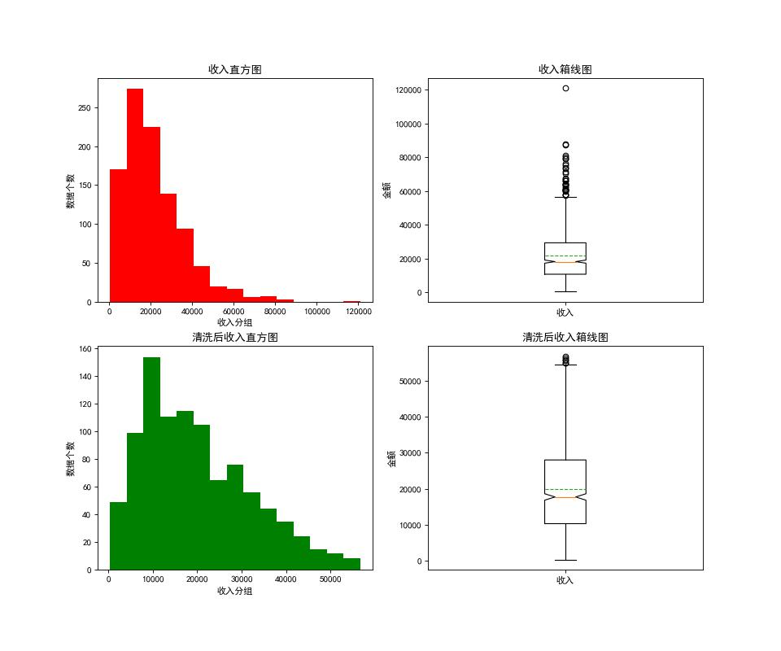
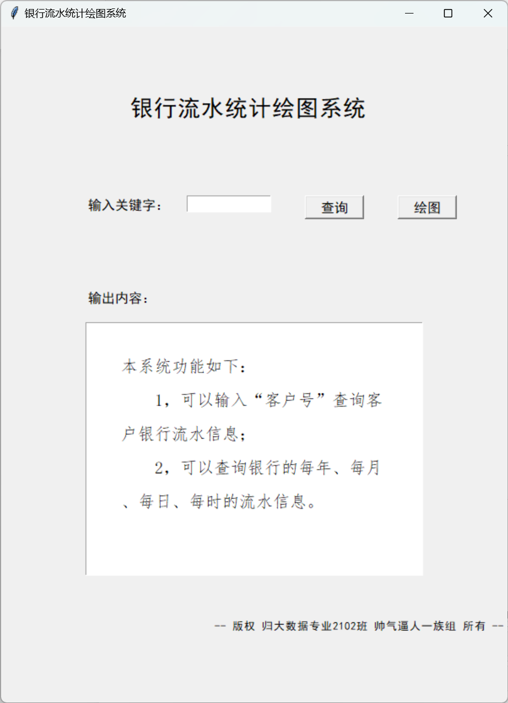
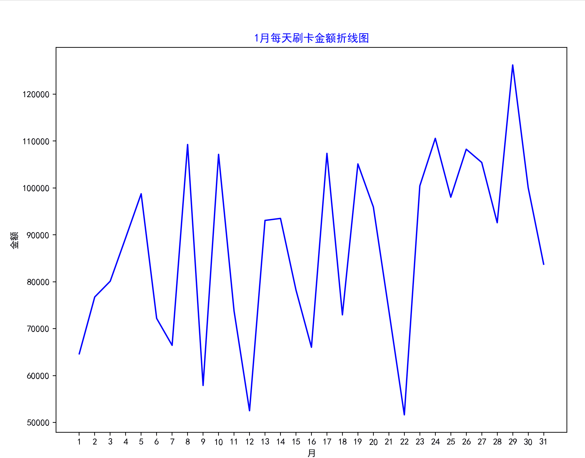
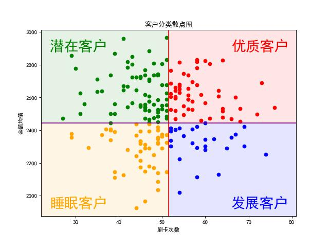

# 银行客户征信数据分析

## 数据分析

### 定性分析

详见[互联网征信数据分析.ipynb](https://github.com/tadpole-2021/Bank-customer-data-analysis/blob/main/1%20-%20%E4%BA%92%E8%81%94%E7%BD%91%E5%BE%81%E4%BF%A1%E6%95%B0%E6%8D%AE%E5%88%86%E6%9E%90.ipynb)

### 定量分析

## 银行刷卡流水数据分析

### 按客户统计信息与时间的相关数据分析（交互式窗口实现）

### 每月每天的刷卡金额（动态图展示）

### 客户分类画像

